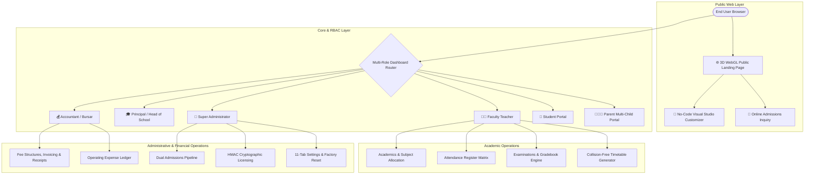

# 🏫 Horizon School Management & Administration System (SMS)

[](https://www.djangoproject.com/)
[](https://www.python.org/)
[](https://getbootstrap.com/)
[](https://threejs.org/)
[-success?style=for-the-badge)](https://github.com/Rudra031/School-Management-V2)
[](mailto:rudrasarkar02@gmail.com)

A modern, enterprise-grade, multi-role School Management & Academic Administration Platform engineered with **Python 3.12+**, **Django 5.2+**, **Bootstrap 5**, **Interactive 3D Three.js WebGL**, and **HMAC-SHA256 Cryptographic Licensing**.

---

## 📢 Evaluation Version & Licensing Notice

> [!IMPORTANT]
> **7-Day Trial Version Included**:  
> This software comes with a pre-configured **7-Day Free Trial** upon installation. All modules and features are fully unlocked during the evaluation period.  
> To continue using the software after the trial expires, or to purchase an official commercial activation key, please contact the developer directly.

### 💰 Pricing & Commercial Subscription Plans

| Plan | Price (INR) | Duration | Description & Features |
| :--- | :--- | :--- | :--- |
| **Free Evaluation Trial** | **₹0 / Free** | **7 Days** | Full access to all 15+ modules, demo seeding, and evaluation testing. |
| **Annual Subscription** | **₹7,000/- INR** | **1 Year** | 1-Year commercial license key, regular updates, bug fixes & email support. |
| **Lifetime Perpetual License** | **₹12,000/- INR** | **Lifetime** | Perpetual license key, one-time payment, lifetime usage & priority developer support. |

### 📬 Developer Contact for Licensing & Activation
- **Developer Email**: [`rudrasarkar02@gmail.com`](mailto:rudrasarkar02@gmail.com)
- **GitHub Repository**: [https://github.com/Rudra031/School-Management-V2](https://github.com/Rudra031/School-Management-V2)

---

## 📑 Table of Contents
1. [Super Attractive 3D Public Landing Page & Web Studio](#-super-attractive-3d-public-landing-page--web-studio)
2. [Specialized Manuals & Guides](#-specialized-manuals--guides-docs)
3. [Key Capabilities & Modules](#-key-capabilities--modules)
4. [Role-Based Access Control & Demo Credentials](#-role-based-access-control--demo-credentials)
5. [System Architecture](#-system-architecture)
6. [Software License & 1-Time Activation Flow](#-software-license--1-time-activation-flow)
7. [Project Directory Structure](#-project-directory-structure)
8. [Quick Start & Installation Guide](#-quick-start--installation-guide)
9. [Automated Test Suite](#-automated-test-suite)

---

## 🌐 Super Attractive 3D Public Landing Page & Web Studio (`/`)

The platform includes a stunning, award-worthy public-facing school website powered by **Three.js WebGL**, fluid glassmorphism, responsive micro-interactions, and a real-time **No-Code Visual Studio Customizer** (`/customizer/`).

```text
+-------------------------------------------------------------------------------------------------+
|                               HORIZON INTERNATIONAL ACADEMY                                    |
| [✨ Interactive 3D WebGL Mesh]   [📢 Rolling Live News Ticker]   [⚡ Fast Online Admissions]     |
| [🎓 Stream / Course Explorer]    [📊 99.4% Pass Rate Stats]     [🏛️ Virtual 360 Campus Tour]   |
+-------------------------------------------------------------------------------------------------+
```

### 🌟 High-Impact Landing Page Features:

#### 1. 🌌 Interactive 3D Three.js WebGL Hero Canvas
- **Kinetic 3D Depth**: Interactive floating geometric polyhedra, particle vortexes, and dynamic celestial nebulae that respond smoothly to mouse movement and cursor parallax.
- **4 Real-Time WebGL Modes**:
  - *Floating Geometric Polyhedra & Nebula* (Default Prestige)
  - *Ambient Particle Vortex*
  - *Minimal 3D Horizon Grid*
  - *Static Luxury CSS Mesh Gradient* (Reduced motion / lightweight fallback)
- **Performance Engine**: 60 FPS hardware-accelerated WebGL with automatic battery & mobile device throttling.

#### 2. 🎨 No-Code Visual Studio Customizer (`/customizer/`)
- **5 Built-in Institutional Theme Presets**:
  1. 🏛️ **Academic Prestige**: Deep slate, obsidian, and royal gold accents.
  2. 🌊 **Modern Blue**: Navy, electric indigo, and cyan highlights.
  3. 🌿 **Emerald Academy**: Deep forest green, jade, and sage.
  4. ☀️ **Minimal Light**: Crisp frosted white, slate, and violet.
  5. 🔮 **Premium Dark**: Obsidian black, neon violet, and cyan glows.
- **Real-Time Palette & Typography Tuning**: Change branding colors, Google Fonts (`Geist`, `Inter`, `Hanken Grotesk`), card corner radius, container widths, and inject custom CSS/JS on-the-fly without restarting the server.

#### 3. 📢 Real-Time Rolling Circulars & Notice Ticker
- High-visibility marquee ticker announcing breaking school alerts, exam dates, holiday notices, and admissions deadlines.

#### 4. 📚 Interactive Curriculum & Stream Explorer
- Visual stream cards covering **Pre-Primary (Montessori)**, **Primary (Grades 1–5)**, **Middle School (Grades 6–8)**, **Secondary (Grades 9–10)**, and **Senior Secondary (Science, Commerce, Humanities)** with subject breakdowns and downloadable syllabus PDFs.

#### 5. 📈 Animated Milestone & Key Stats Counter
- Live animated counters showcasing institutional achievements:
  - 🏆 **99.4%** CBSE Board Distinction Rate
  - 🎓 **100+** Top University Placements
  - 🔬 **35+** Advanced Science & Robotics Labs
  - 🎒 **4,000+** Active Students Enrolled

#### 6. 🏛️ Campus Infrastructure & Laboratory Tour Gallery
- Filterable, high-resolution media gallery highlighting Smart Classrooms, Computer Laboratories, Olympic Swimming Pool, Library Vault, and Indoor Sports Arena.

#### 7. 👨‍🏫 Faculty Leadership & Department Showcase
- Interactive faculty profile cards detailing academic qualifications, awards, research papers, and subject expertise.

#### 8. 💬 Parent, Student & Alumni Testimonial Carousel
- Verified parent reviews, student accolades, and alumni success stories with star ratings and authentic quotes.

#### 9. 📝 Instant Online Admissions Inquiry & Lead Capture
- Prospective parents can submit admission inquiries online with instant validation, generating automated lead tickets directly in the **Admissions Pipeline** (`/admissions/pipeline/`).

#### 10. 📍 Campus Visit & Contact Hub
- Interactive contact dispatch form, direct phone/email hotlines, office working hours, and embedded Google Maps geolocation.

---

## 📚 Specialized Manuals & Guides (`docs/`)

| Document | Audience | Highlights |
| :--- | :--- | :--- |
| 📖 [**User Guide (`docs/USER_GUIDE.md`)**](docs/USER_GUIDE.md) | School Admins, Teachers, Accountants, Parents & Students | Illustrated workflows, fast-fill login, admissions dual pipeline, fee invoicing, student & parent portals, and report cards. |
| 🛠️ [**Developer Guide (`docs/DEVELOPER_GUIDE.md`)**](docs/DEVELOPER_GUIDE.md) | Software Developers, DevOps & Vendors | Architecture, license generator, 1-time anti-replay security, remote license revocation, factory reset engine, and deployment. |
| 🚀 [**Deployment Guide (`docs/DEPLOYMENT_GUIDE.md`)**](docs/DEPLOYMENT_GUIDE.md) | System Administrators & IT Teams | Linux VPS setup, PostgreSQL 16 configuration, Gunicorn daemon, Nginx reverse proxy, and SSL/TLS certificates. |
| 🎓 [**Admissions Guide (`docs/ADMISSIONS_GUIDE.md`)**](docs/ADMISSIONS_GUIDE.md) | Admission Staff & Registrars | Quick Admission (1-page fast track), 1-click continuation bridge, and 10-step full dossier wizard. |
| 📂 [**Documentation Index (`docs/README.md`)**](docs/README.md) | All Users & Developers | Complete central documentation index and table of contents. |

---

## ✨ Key Capabilities & Modules

### 1. 🎓 Student Academic Portal (`/dashboard/student/`)
- **Dynamic Attendance Gauge**: Real-time attendance rate calculation (% Present, % Late/Half-Day, % Absent) directly from class registers.
- **Live Class Schedule**: Daily timetable with period times, classroom number, subject, and assigned faculty.
- **Homework Hub**: View pending homework deadlines, download teacher attachments, and upload completed assignments.
- **Official Marksheets & Admit Cards**: Direct access to downloadable term report cards and exam hall passes.
- **Fee Ledger & Balance Tracking**: Itemized fee breakdown with cleared/pending invoice badges.
- **Printable Digital ID Card** (`/students/id-card/<id>/`): Standard CR80 PVC identity badge with school branding, photo, barcode, and principal signature.

### 2. 👨‍👩‍👧 Parent & Guardian Monitoring Hub (`/dashboard/parent/`)
- **Multi-Child Sibling Switcher**: Instant toggle between multiple enrolled wards with active session synchronization.
- **Ward Attendance & Progress**: Real-time attendance percentage and attendance session count for the active child.
- **Fee Management & Receipts**: Complete fee statements with balance payment warnings and thermal/A4 receipt downloads.
- **Ward Timetable Matrix** (`/parents/ward-timetable/`): Weekly period schedule of the child's section.
- **Ward Leave Applications** (`/parents/apply-leave/`): Parents can apply for medical or personal leaves for their ward with doctor note attachments.

### 3. 🚀 Dual-Mode Admissions Pipeline
- **Mode 1: Quick Admission (Fast Track)** &mdash; 1-page rapid enrollment with core student/guardian info and instant class/section allocation.
- **1-Click Continuation Bridge** &mdash; Enrolls student instantly, then seamlessly continues into the 10-step full dossier pre-populated with student data.
- **Mode 2: 10-Step Full Admission Wizard** &mdash; Comprehensive dossier including family background, statutory IDs (Aadhaar/PEN), medical history, previous school TC records, and document uploads.

### 4. 📊 Attendance Register Matrix
- One-click daily / period-based class attendance marking.
- Automated low attendance alerts for students falling below **75%**.

### 5. 💳 Fee Invoicing & Receipts
- Custom fee structures (Tuition, Lab, Sports, Library, Exams, Transport).
- Term-wise bulk invoice generation with discount and concession tracking.
- Instant 3-part thermal and standard printable receipts with barcodes.

### 6. 📝 Examinations & Automated Report Cards
- GPA and Letter Grade scales with customizable percentage bands.
- Auto-calculation of total scores, percentages, class ranks, and attendance.
- High-resolution printable official institutional report cards.

### 7. 🛡️ Cryptographic Licensing & Anti-Replay Security
- Protected by 256-bit HMAC-SHA256 digital signature tokens.
- **1-Time Process**: Cryptographic nonces prevent replaying expired keys.
- **Developer Control**: Full CLI commands to issue 1-year, multi-year, lifetime keys, or revoke licenses remotely.
- **Clock Rollback Guard**: Detects local server time tampering and enforces integrity.

### 8. 🏢 Operational & Resource Management
- **Library Catalog & Loan Circulation**: ISBN lookups, barcode check-in/check-out, overdue fine tracking.
- **Staff & Faculty Directory**: Designations, salary structures, payslips, and document repository.
- **Operating Expense Ledger**: Track recurring school expenditures with expense category vouchers.
- **Inventory & Assets**: Manage school physical equipment, condition ratings, and room custody.
- **Institutional Settings (11 Tabs)**: Global school branding, academic sessions, grading rules, 2FA factory reset, and license activation.

---

## 👥 Role-Based Access Control & Demo Credentials

All demonstration accounts are seeded with password: `Password@123`

```text
+-----------------------------------------------------------------------------------+
| Role                  | Demo Email / Login ID    | Password     | Access Level     |
|-----------------------|--------------------------|--------------|------------------|
| 👑 Super Administrator| admin@school.edu         | Password@123 | Full System      |
| 🎓 Principal          | principal@school.edu     | Password@123 | Academic Exec    |
| 👨‍🏫 Faculty Teacher   | teacher@school.edu       | Password@123 | Class & Grades   |
| 💰 Accountant         | accountant@school.edu    | Password@123 | Fees & Finance   |
| 🎒 Student            | student@school.edu       | Password@123 | Student Portal   |
| 👨‍👩‍👦 Parent / Guardian  | parent@school.edu        | Password@123 | Multi-Child Hub  |
+-----------------------------------------------------------------------------------+
```

---

## 🏛 System Architecture



---

## 🔑 Software License & 1-Time Activation Flow

```text
+---------------------------------------------------------------------------+
| 1. COPY INSTALL ID      2. CONTACT DEVELOPER       3. ACTIVATE LICENSE    |
| [INST-8841-EC45-0715] -> [rudrasarkar02@gmail.com] -> [Paste Token & Unlock]|
+---------------------------------------------------------------------------+
```

1. **Step 1: Obtain System Install ID**
   - Open **Settings &rarr; Tab 11 (Software License)** or view the **Lockout Screen**.
   - Copy your unique **Server Installation ID** (e.g., `INST-8841-EC45-0715`) and **School Code**.
2. **Step 2: Request Activation Key**
   - Email the developer at **`rudrasarkar02@gmail.com`** specifying your plan (**1-Year Subscription ₹7,000/-** or **Lifetime License ₹12,000/-**).
3. **Step 3: Paste Key & Unlock**
   - Enter the developer-generated cryptographic key into the activation form and click **Validate & Activate License Key**.

---

## 📂 Project Directory Structure

```text
school_management/
├── docs/                       # 📚 Dedicated Documentation Hub
│   ├── README.md               # Documentation Catalog & Index
│   ├── USER_GUIDE.md           # 📖 School End-User & Staff Manual (Illustrated)
│   ├── DEVELOPER_GUIDE.md      # 🛠️ Developer Control, Architecture & Monetization
│   ├── DEPLOYMENT_GUIDE.md     # 🚀 Linux VPS & Production Deployment Runbook
│   └── ADMISSIONS_GUIDE.md     # 🎓 Dual Admissions Pipeline (Quick vs Full)
├── deploy/                     # 🚀 Production Server Deployment & Configurations
│   ├── docker/                 # Dockerfile & Docker Compose multi-container setup
│   ├── gunicorn/               # WSGI server process configuration
│   ├── nginx/                  # Reverse proxy & SSL termination configuration
│   ├── systemd/                # Linux systemd background service daemon unit
│   └── README.md               # Quick deployment instructions
├── tools/                      # 🛠️ Standalone Developer CLI Utilities
│   ├── license_generator.py    # Zero-dependency offline HMAC license generator
│   └── README.md               # Developer utilities guide
├── config/                     # Django core project configuration (settings, urls, wsgi)
├── core/                       # Core singleton models, licensing engine, audit logs
├── accounts/                   # 9-Role RBAC authentication & dashboard router
├── academics/                  # Classes, sections, subjects, academic years
├── students/                   # Permanent student SIS records & ID cards
├── staff/                      # Faculty directory, payroll & designations
├── parents/                    # Multi-child parent portal & ward leaves
├── admissions/                 # Dual admissions pipeline & student conversion
├── attendance/                 # Attendance register matrix (<75% alerts)
├── fees/                       # Fee invoicing, receipts, ledger
├── examinations/               # Exams, grading scales & report cards
├── timetable/                  # Timetable generator
├── library/                    # Book catalog & circulation
├── documents/                  # Secure document repository
├── inventory/                  # Asset management & custody
├── expenses/                   # Operating expense vouchers
├── reports/                    # Reports hub & analytics
├── website/                    # School marketing homepage & 3D WebGL customizer
├── templates/                  # Frontend UI templates
└── README.md                   # 🏫 Root Master Project Overview
```

---

## ⚡ Quick Start & Installation Guide

### 1. Clone & Setup Virtual Environment
```powershell
# Clone the repository
git clone https://github.com/Rudra031/School-Management-V2.git
cd School-Management-V2

# Create and activate virtual environment
python -m venv venv
.\venv\Scripts\activate

# Install dependencies
pip install -r requirements.txt
```

### 2. Apply Migrations & Seed Demo Data
```powershell
# Run database migrations
python manage.py migrate

# Seed complete demo data (superadmin, teachers, students, parents, courses, website)
python manage.py seed_demo_data
python manage.py seed_website
```

### 3. Launch Development Server
```powershell
python manage.py runserver
```
- Open **`http://127.0.0.1:8000/`** to experience the **3D Interactive Public Landing Page**.
- Open **`http://127.0.0.1:8000/accounts/login/`** in your browser and use any of the **Demo Fast-Fill** persona buttons to log in to the administrative portal!

---

## 🧪 Automated Test Suite

The codebase comes with a comprehensive test suite across all 15 applications:

```powershell
python manage.py test
```

> **Test Suite Output**:
> ```text
> Ran 85 tests in 187.153s
> OK
> ```

---

## 📬 Commercial Inquiries & Support

For commercial license purchases, custom branding, or deployment support:
- **Developer**: Rudra Sarkar
- **Email**: [`rudrasarkar02@gmail.com`](mailto:rudrasarkar02@gmail.com)
- **GitHub**: [https://github.com/Rudra031/School-Management-V2](https://github.com/Rudra031/School-Management-V2)
