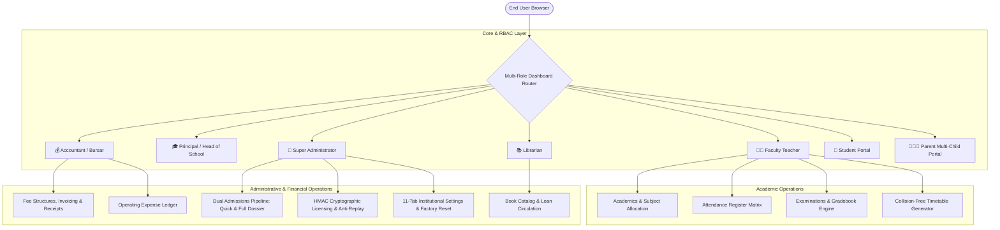

<<<<<<< HEAD
# 🏫 Horizon School Management & Administration System (SMS)

[](https://www.djangoproject.com/)
[](https://www.python.org/)
[](https://getbootstrap.com/)
[-success?style=for-the-badge)](https://github.com/)

A modern, enterprise-grade, multi-role School Management & Academic Administration Platform engineered with **Python 3.12+**, **Django 5.2+**, **Bootstrap 5**, and **HMAC-SHA256 Cryptographic Licensing**.

---

## 📚 Specialized Manuals & Guides (`docs/`)

| Document | Audience | Highlights |
| :--- | :--- | :--- |
| 📖 [**User Guide (`docs/USER_GUIDE.md`)**](docs/USER_GUIDE.md) | School Admins, Teachers, Accountants, Parents & Students | Visual workflows, fast-fill login, admissions dual pipeline, fee invoicing, attendance matrix, and report card generation. |
| 🛠️ [**Developer Guide (`docs/DEVELOPER_GUIDE.md`)**](docs/DEVELOPER_GUIDE.md) | Software Developers, DevOps & Vendors | System architecture, license generation, 1-time anti-replay security, remote license revocation, factory reset engine, and production deployment. |
| 🚀 [**Deployment Guide (`docs/DEPLOYMENT_GUIDE.md`)**](docs/DEPLOYMENT_GUIDE.md) | System Administrators & IT Teams | Linux VPS setup, PostgreSQL 16 configuration, Gunicorn systemd daemon, Nginx reverse proxy, and SSL/TLS. |
| 🎓 [**Admissions Guide (`docs/ADMISSIONS_GUIDE.md`)**](docs/ADMISSIONS_GUIDE.md) | Admission Staff & Registrars | Quick Admission, 1-click continuation, 10-step full dossier, and document uploads. |
| 📂 [**Documentation Index (`docs/README.md`)**](docs/README.md) | All Users & Developers | Complete central documentation index and table of contents. |

## 📂 Reorganized Project Structure

```text
school_management/
├── docs/                       # 📚 Dedicated Documentation Hub
│   ├── README.md               # Documentation Catalog & Index
│   ├── USER_GUIDE.md           # 📖 School End-User & Staff Manual (Illustrated)
│   ├── DEVELOPER_GUIDE.md      # 🛠️ Developer Control, Architecture & Monetization
│   ├── DEPLOYMENT_GUIDE.md     # 🚀 Linux VPS & Production Deployment Runbook
│   ├── LICENSING_GUIDE.md      # 🔑 HMAC-SHA256 Licensing & Activation Reference
│   └── ADMISSIONS_GUIDE.md     # 🎓 Dual Admissions Pipeline (Quick vs Full)
├── deploy/                     # 🚀 Production Deployment & Server Configs
│   ├── docker/                 # Dockerfile & Docker Compose definitions
│   ├── gunicorn/               # WSGI server process configuration
│   ├── nginx/                  # Reverse proxy & SSL routing configuration
│   ├── systemd/                # Linux systemd background service unit
│   └── README.md               # Deployment directory overview
├── tools/                      # 🛠️ Standalone Developer CLI Utilities
│   ├── license_generator.py    # Zero-dependency offline HMAC license generator
│   └── README.md               # Tools usage guide
├── config/                     # Django root application (settings, urls, wsgi)
├── core/                       # Core singleton models, licensing engine, audit logs
├── accounts/                   # 9-Role RBAC authentication & dashboard router
├── academics/                  # Classes, sections, subjects, academic years
├── students/                   # Permanent student SIS records
├── staff/                      # Faculty directory & designations
├── parents/                    # Multi-child parent portal
├── admissions/                 # Dual admissions pipeline & student conversion
├── attendance/                 # Attendance register matrix (<75% alerts)
├── fees/                       # Fee invoicing, receipts, ledger
├── examinations/               # Exams, grading scales & report cards
├── timetable/                  # Timetable generator
├── library/                    # Book catalog & circulation
├── documents/                  # Secure document repository
├── inventory/                  # Asset management & custody
├── expenses/                   # Operating expense vouchers
├── reports/                    # Reports hub & analytics
├── website/                    # School marketing homepage
├── templates/                  # Frontend UI templates
└── README.md                   # 🏫 Root Master Project Overview
```

---


## 🏛 System Architecture



---

## 👥 Role-Based Access Control & Fast-Fill Demo Personas

All demonstration accounts are seeded with password: `Password@123`

```text
+-----------------------------------------------------------------------------------+
| Role                  | Demo Email / Login ID    | Password     | Access Level     |
|-----------------------|--------------------------|--------------|------------------|
| 👑 Super Administrator| admin@school.edu         | Password@123 | Full System      |
| 🎓 Principal          | principal@school.edu     | Password@123 | Academic Exec    |
| 👨‍🏫 Faculty Teacher   | teacher@school.edu       | Password@123 | Class & Grades   |
| 💰 Accountant         | accountant@school.edu    | Password@123 | Fees & Finance   |
| 🎒 Student            | student@school.edu       | Password@123 | Student Portal   |
| 👨‍👩‍👦 Parent / Guardian  | parent@school.edu        | Password@123 | Multi-Child Hub  |
+-----------------------------------------------------------------------------------+
```

---

## ✨ Key Capabilities & Modules

### 1. 🚀 Dual-Mode Admissions Pipeline
- **Mode 1: Quick Admission (Fast Track)** &mdash; 1-page rapid enrollment with core student/guardian info and instant class/section allocation.
- **Option to Continue Full Dossier** &mdash; Enrolls student instantly, then seamlessly continues into the 10-step full dossier pre-populated with student data.
- **Mode 2: 10-Step Full Admission Wizard** &mdash; Comprehensive dossier including family backgrounds, statutory IDs (Aadhaar/PEN), medical history, previous school TC records, document uploads, and transport allocations.

### 2. 📊 Attendance Matrix & Alerts
- One-click daily / period-based class attendance marking.
- Automated low attendance warnings for students falling below **75%**.

### 3. 💳 Fee Invoicing & Receipts
- Custom fee structures (Tuition, Lab, Sports, Library, Exams, Transport).
- Term-wise bulk invoice generation with discount and fine waiver tracking.
- Instant 3-part thermal and standard printed receipts with barcodes.

### 4. 📝 Examinations & Automated Report Cards
- GPA and Letter Grade scales with customizable percentage bands.
- Auto-calculation of total scores, percentages, class ranks, and attendance.
- High-resolution printable official institutional report cards.

### 5. 🛡️ Cryptographic Licensing & Anti-Replay Security
- Protected by 256-bit HMAC-SHA256 digital signature tokens.
- **1-Time Process**: Cryptographic nonces prevent replaying expired keys.
- **Developer Control**: Full CLI commands to issue 1-year, multi-year, lifetime keys, or revoke licenses remotely.
- **Clock Rollback Guard**: Detects local time tampering and enforces integrity.

---

## ⚡ Quick Start Guide

### 1. Clone & Setup Virtual Environment
```powershell
# Navigate to project directory
cd d:\school_management

# Create and activate virtual environment
python -m venv venv
.\venv\Scripts\activate

# Install dependencies
pip install -r requirements.txt
```

### 2. Migrate Database & Seed Demo Data
```powershell
# Run database migrations
python manage.py migrate

# Seed pre-configured demonstration accounts & records
python manage.py seed_demo_data
```

### 3. Launch Development Server
```powershell
python manage.py runserver
```
Visit `http://127.0.0.1:8000/accounts/login/` and click any fast-fill role button to explore the system!

---

## 🧪 Test Suite Execution
```powershell
python manage.py test core accounts admissions website documents
```
> Result: **58/58 tests passed (100% OK)**
=======
# School-Management-V2
>>>>>>> 4b896103cae7d9e9257d1515593ee18c015a1cba
