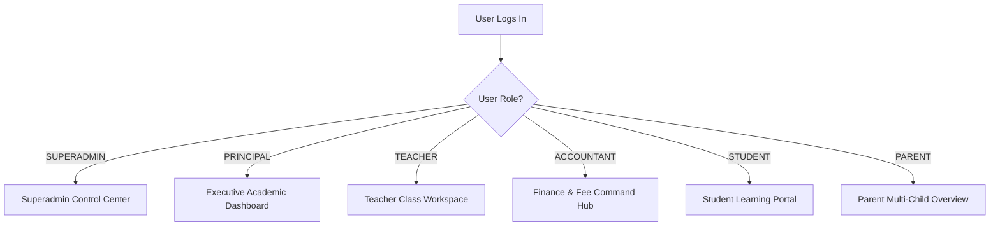

# 📖 Horizon School Management System — Complete User Guide

Welcome to the **Horizon School Management & Administration System (SMS)** user guide. This guide is crafted for school administrators, principals, faculty teachers, bursars/accountants, parents, and students.

---

## 📑 Table of Contents
1. [System Access & Login Portal](#1-system-access--login-portal)
2. [Role-Based Dashboards](#2-role-based-dashboards)
3. [Student Admissions Management (Dual Mode)](#3-student-admissions-management-dual-mode)
4. [Academic & Class Management](#4-academic--class-management)
5. [Attendance Sheet Matrix](#5-attendance-sheet-matrix)
6. [Fee Structure, Invoicing & Receipts](#6-fee-structure-invoicing--receipts)
7. [Examinations, Gradebook & Report Cards](#7-examinations-gradebook--report-cards)
8. [Timetable & Schedule Engine](#8-timetable--schedule-engine)
9. [Library & Circulation Management](#9-library--circulation-management)
10. [Institutional Settings & Configurations (11 Tabs)](#10-institutional-settings--configurations-11-tabs)
11. [Software License & 1-Time Activation Guide](#11-software-license--1-time-activation-guide)

---

## 1. System Access & Login Portal

The login portal features an intelligent multi-role authentication backend supporting both **Email Addresses** and **User IDs**.

```text
+-------------------------------------------------------------------------+
|                  🏫 HORIZON SCHOOL MANAGEMENT SYSTEM                    |
|                                                                         |
|  [ Email / User ID: ______________________ ]                            |
|  [ Password:        ••••••••••••••••______ ]                            |
|                                                                         |
|  [ ⚡ Sign In to Institutional Portal ]                                 |
|                                                                         |
|  ------------------------- DEMO FAST-FILL ---------------------------- |
|  [ 👑 Superadmin ] [ 🎓 Principal ] [ 👨‍🏫 Teacher ]                    |
|  [ 💰 Accountant ] [ 🎒 Student   ] [ 👨‍👩‍👦 Parent  ]                    |
+-------------------------------------------------------------------------+
```

### Fast-Fill Demo Personas:
Clicking any role chip instantly fills the credentials and animates floating form labels:

| Persona | Login ID / Email | Password | Primary Role |
| :--- | :--- | :--- | :--- |
| **Super Administrator** | `admin@school.edu` | `Password@123` | Institutional Control & Global Settings |
| **Principal** | `principal@school.edu` | `Password@123` | Academic Oversight & Executive Analytics |
| **Teacher / Faculty** | `teacher@school.edu` | `Password@123` | Attendance, Homework, Exam Marks |
| **Accountant / Bursar** | `accountant@school.edu` | `Password@123` | Fee Invoices, Collections, Expenses |
| **Student** | `student@school.edu` | `Password@123` | Timetable, Homework, Report Cards |
| **Parent / Guardian** | `parent@school.edu` | `Password@123` | Multi-Child Switching, Invoices, Progress |

---

## 2. Role-Based Dashboards

Upon authentication, the **Dashboard Router** directs each user to their role-specific workspace:



- **Superadmin Dashboard**: KPI metrics on student strength, revenue collections, faculty headcount, system health, and audit logs.
- **Teacher Dashboard**: Daily period schedule, quick attendance buttons, pending assignment submissions, and upcoming examination terms.
- **Parent Portal**: Child selector dropdown (switch between siblings seamlessly), attendance %, fee payment statuses, and downloadable PDF report cards.

---

## 3. Student Admissions Management (Dual Mode)

The system provides a **Dual Admission Pipeline** engineered for speed and thoroughness:

```text
                  +--------------------------------+
                  |  ADMISSIONS CONTROL PIPELINE   |
                  +---------------+----------------+
                                  |
            +---------------------+---------------------+
            |                                           |
            v                                           v
  [ MODE 1: QUICK ADMISSION ]                 [ MODE 2: FULL 10-STEP ]
  - 1-Page Rapid Entry                        - 10-Step Comprehensive Dossier
  - Core Mandatory Details                    - Family, Medical & Statutory IDs
  - Instant Class & Section Enrollment        - Document Uploads (TC, Marksheets)
  - Continue Full Dossier Option              - Transport & Fee Configurations
```

### Mode 1: Quick Admission (Fast Track)
1. Navigate to **Admissions &rarr; Quick Admission**.
2. Enter basic student information:
   - First Name, Last Name, Date of Birth, Gender.
   - Class Level & Assigned Section.
   - Parent / Guardian Name, Phone, Email, and Residential Address.
3. Click either:
   - **"Save & Finish Quick Admission"**: Instant enrolls the student and generates registration ID.
   - **"✨ Save & Continue Full Admission Process &rarr;"**: Enrolls the student and automatically opens the 10-step full wizard pre-loaded with this student's data.

### Mode 2: Full Multi-Step Admission Dossier (10 Steps)
1. **Step 01: Demographics** &mdash; Personal bio, blood group, Aadhaar/ID proof, passport photo.
2. **Step 02: Family Info** &mdash; Father and Mother details, occupations, phones, primary guardian.
3. **Step 03: Address & Emergency** &mdash; Permanent address, emergency telephony contact.
4. **Step 04: Previous Education** &mdash; Previous school name, affiliated board, TC number, and date.
5. **Step 05: Academic Placement** &mdash; Academic session, Class, Section, second language.
6. **Step 06: Medical Records** &mdash; Allergies, chronic conditions, family doctor, dietary notes.
7. **Step 07: Document Center** &mdash; Upload Transfer Certificate (TC), previous marksheet, character certificate, birth certificate.
8. **Step 08: Additional Services** &mdash; Transport bus route, hostel room allocation.
9. **Step 09: Review & Verify** &mdash; Matrix overview of all submitted data.
10. **Step 10: Finalize & Enroll** &mdash; Automatic roll number allocation, fee invoice generation, and printable official admission letter.

---

## 4. Academic & Class Management

Manage classes, sections, subjects, and departmental curricula:
1. Navigate to **Academics &rarr; Class Levels**.
2. View class capacity, enrolled students, assigned class teachers, and subject allocations.
3. Assign sections (e.g. `Grade 10 - Section A`, `Grade 10 - Section B`).

---

## 5. Attendance Sheet Matrix

Fast and intuitive daily / period-based attendance marking:

```text
+-----------------------------------------------------------------------------------+
|  ATTENDANCE REGISTER — Grade 10-A • Date: 31 Aug 2026                             |
|  [ Mark All Present (P) ]  [ Mark All Absent (A) ]                               |
|-----------------------------------------------------------------------------------|
| Roll | Student Name         | Present (P) | Absent (A) | Late (L) | Half-Day (H) |
|------|----------------------|:-----------:|:----------:|:--------:|:------------:|
| 101  | Aarav Sharma         |    ( • )    |    (   )   |   (   )  |     (   )    |
| 102  | Ananya Iyer          |    ( • )    |    (   )   |   (   )  |     (   )    |
| 103  | Rohan Verma          |    (   )    |    ( • )   |   (   )  |     (   )    |
|-----------------------------------------------------------------------------------|
| [ 💾 Save & Synchronize Class Attendance Matrix ]                                 |
+-----------------------------------------------------------------------------------+
```

- **Low Attendance Alerts**: Automatically flags students with attendance below 75%.
- **Monthly Summary Sheets**: One-click Excel and PDF export of complete attendance registers.

---

## 6. Fee Structure, Invoicing & Receipts

Comprehensive finance engine for Indian and international schooling standards:
1. **Fee Structures**: Define tuition, computer lab, library, sports, examination, and transport fees.
2. **Bulk Invoicing**: Generate term-wise fee invoices for entire classes with 1 click.
3. **Payment Collection**:
   - Collect payments via Cash, Cheque, UPI, Bank Transfer, or Online Gateway.
   - Record partial payments, discounts, and late fine waivers.
4. **Printable Receipts**: Instant 3-part thermal or standard printed fee receipts with barcode.

---

## 7. Examinations, Gradebook & Report Cards

1. **Exam Terms**: Configure Term 1, Mid-Term, Term 2, Annual Exams.
2. **Gradebook Matrix**: Teachers input marks; the system computes GPA, letter grades, rank, and percentage automatically.
3. **Report Card Generator**: Generate and print official institutional report cards featuring school emblem, grading legend, teacher remarks, and attendance summary.

---

## 8. Timetable & Schedule Engine

- **Conflict-Free Scheduling**: Prevents room and teacher collisions automatically.
- **Weekly Matrix View**: View timetable by Class or by Teacher.
- **Printable Timetable**: PDF export for classroom notice boards.

---

## 9. Library & Circulation Management

- **Catalog Directory**: ISBN, Title, Author, Category, Rack/Shelf location.
- **Book Issue & Return**: Fast issue to students and faculty using Student ID barcode.
- **Overdue Tracking**: Automated calculation of overdue fines ($1/day or ₹10/day).

---

## 10. Institutional Settings & Configurations (11 Tabs)

Administrators have access to **Settings** organized into 11 tabs:

```text
+---------------------------------------------------------------------------+
|                          INSTITUTIONAL SETTINGS                           |
|---------------------------------------------------------------------------|
| [ 1. General Info   ] [ 2. Branding & Logo ] [ 3. Academics & Grading ]   |
| [ 4. Admissions     ] [ 5. Finance & Tax   ] [ 6. Attendance & Leave  ]   |
| [ 7. Security & 2FA ] [ 8. Email / SMS     ] [ 9. Backup & Data       ]   |
| [ 10. Factory Reset ] [ 11. License & Key  ]                              |
+---------------------------------------------------------------------------+
```

- **Tab 1–3**: School Name, Address, Affiliation Code, Currency symbol, Grading scale.
- **Tab 10 (Factory Reset)**: Two-factor authenticated hard reset system to purge demo data and prepare the installation for live production.
- **Tab 11 (Software License)**: Server machine installation ID, active commercial status, and activation portal.

---

## 11. Software License & 1-Time Activation Guide

### How to Get Your License Key (3 Steps):
1. **Step 1: Copy System Identity**
   - Go to **Settings &rarr; Tab 11 (Software License)** or open the **Lockout Screen**.
   - Note your **School Code** (e.g. `HPS-DELHI`) and unique **Server Installation ID** (e.g. `INST-8841-EC45-0715`).
2. **Step 2: Send to Developer**
   - Click **"WhatsApp Request"** or **"Email Request"** (or click **"Copy Full Request Text"**).
   - This pre-formats the message with your hardware machine fingerprint.
3. **Step 3: Paste Key & Activate**
   - Paste the developer-signed license key (`HRZN.eyJ...`) into the activation box and click **Validate & Activate License Key**.
   - The software unlocks instantly with your commercial license.

> **Important**: Each key is a **1-time cryptographic key**. Once expired, contact your software vendor for a fresh renewal code.

---

## 12. Student Learning & Academic Portal

The Student Portal (`/dashboard/student/`) is tailored for self-guided student learning:

```text
+---------------------------------------------------------------------------+
| 🎓 STUDENT ACADEMIC PORTAL — Peter Parker (Grade 9-A)                     |
| Roll No: 12 • Admission No: ADM-2026-0099 • Blood Group: O+               |
|                                                                           |
| [ 🪪 Digital ID Card ] [ 📅 Full Timetable ] [ 📄 Admit Card ] [ 📑 Marksheet ]
|                                                                           |
| 🟢 Attendance Rate: 96.4%     📝 Pending Homework: 2 Due                  |
| 🏆 Graded Subjects: 6         💰 Fee Balance: ₹0.00 (Cleared)             |
+---------------------------------------------------------------------------+
```

### Key Student Capabilities:
1. **Live Daily Timetable**: Displays current day's periods with start/end time, subject, room number, and teacher.
2. **Weekly Timetable Matrix** (`/students/my-timetable/`): Full weekly calendar view with one-click print function.
3. **Homework Submission**: View pending assignments, download teacher attachments, and upload completed PDF homework files.
4. **Attendance History Matrix** (`/students/my-attendance/`): Detailed breakdown of daily attendance records, with % calculation.
5. **Printable Digital ID Card** (`/students/id-card/<id>/`): High-resolution standard CR80 PVC identity badge with institutional branding, photo, barcode, and principal signature block.
6. **Academic Reports & Marksheets**: Download term report cards and exam admit cards directly.

---

## 13. Parent & Guardian Monitoring Hub

The Parent Portal (`/dashboard/parent/`) provides multi-ward academic oversight:

```text
+---------------------------------------------------------------------------+
| 👨‍👩‍👧 PARENT & GUARDIAN MONITORING HUB — David Vance                      |
| Active Ward: [ 🎓 Lucas Vance (Grade 9-A) ▾ ]  <-- Multi-Child Switcher   |
|                                                                           |
| [ ✈️ Apply for Leave ] [ 📅 Ward Timetable ] [ 📄 Admit Card ] [ 📑 Marksheet ]
|                                                                           |
| 🟢 Ward Attendance: 98.2%     📝 Pending Homework: 1 Due                  |
| 🏆 Evaluated Subjects: 5      💰 Fee Balance Due: ₹4,500.00               |
+---------------------------------------------------------------------------+
```

### Key Parent Capabilities:
1. **Multi-Child Switcher**: Parents with multiple enrolled children can switch active wards instantly using the dropdown chip. The selection synchronizes across all tabs.
2. **Ward Attendance & Progress**: Real-time attendance rate calculated from official class registers.
3. **Fee Ledger & Payment Receipts**: Full breakdown of invoiced tuition, paid sums, balance due, and printable fee receipts.
4. **Ward Timetable** (`/parents/ward-timetable/`): Weekly period schedule of the child's class.
5. **Ward Leave Applications** (`/parents/apply-leave/`): Parents can apply for medical or emergency leaves for their ward, attaching doctor certificates and doctor notes.
6. **Exam Results**: Direct access to ward's term examination results and official school marksheets.

